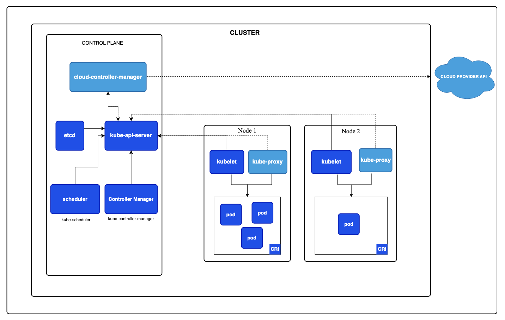

---
categories:
- devops
date: "2024-12-18T15:14:49+09:00"
draft: false
tags:
- kubernetes
title: '[Kubernetes] Cluster Architecture'
---

- **k8s Cluster**
  - A set of machines (nodes) that run containerized applications managed by Kubernetes

> 

- **Control Plane**
  - central component responsible for managing overall state and operations of k8s cluster.
    - scheduling workloads
    - maintaining the desired state of applications
    - etc ...
    - can be run on any machine in the cluster (but usually in master node)
- **Node**
  - A single machine (either physical or virtual) in a k8s cluster that runs application worksloads.
  - Each node is a worker machine where k8s schedules and manages pods
    - 2 Types of Nodes
      - **Master Node** (Control Plane Node)
        - runs **control plane**
        - but possible to run containerized apps too ((depending on configuration))
      - **Worker Node**
        - runs actual applications. It hosts pods that contain containerized applications.

### Control Plane Components

- **kube-apiserver**
  - exposes the k8s API as the front end for the k8s control plane
  - kube-apiserver is what's called you `kubectl`
  - responsible for 
    - authenticating user and validating its request 
    - retrieving and updating data (from etcd). kube-apiserver is the only component that interacts with etcd. Other components (such as sceduler & kubulet) has to go through kube-apiserver to get/set data in etcd 
- **ETCD(in General)**
  - distributed reliable key-value store that is simple, secure & fast
  - specially designed for distributed systems(like k8s) to store small, rapidly changing configuration data
  - etcd official [documentation](https://etcd.io/docs/) 
- **ETCD(in k8s)**
  - stores information about cluster aobut nodes, pods, configs, secrets, accounts, roles, and others ...
  - every change you make to your cluster is updated in the etcd server
  - only once data is updated in the etcd server, is the change consideered to be complete
- **kube-controller-manager**
  - manages and packages various controller into a single process in k8s. Some examples are ... 
    - Node controller: Responsible for noticing and responding when nodes go down. 
    - Job controller: Watches for Job objects that represent one-off tasks, then creates Pods to run those tasks to completion. 
    - EndpointSlice controller: Populates EndpointSlice objects (to provide a link between Services and Pods). 
    - ServiceAccount controller: Create default ServiceAccounts for new namespaces.
    - more...
- **kube-scheduler**
  - responsible for deciding which pod goes on which nodes
  - does not actually place the pod on nodes (that is the job for kubelet)
  - how? 
    - by considering factors such as individual and collective resource requirements, hardware/software/policy constraints, affinity and anti-affinity specifications, data locality, inter-workload interference, and deadlines.s
- **cloud-controller-manager**
  - unnecessary if running k8s locally (in non-cloud environment)
  - links your cluster into your cloud provider's API 
  - separates out components that interact with that cloud platform from components that only interact with your cluster 
  - abstracts cloud-specific operations from the core Kubernetes components, allowing Kubernetes to integrate seamlessly with various cloud providers (like AWS, Azure, Google Cloud, etc.). 

### Node Components 
- **kubelet**
  - as an agent that runs on each node in cluster, it is the sole point of contact from master node. 
    - registers node 
    - create pods 
    - make sure containers are running in a pod 
    - monitor the node and pods
    - etc... 
- **Container runtime**
  - A fundamental component that empowers Kubernetes to run containers effectively. It is responsible for managing the execution and lifecycle of containers within the Kubernetes environment.
  - Kubernetes supports container runtimes such as containerd, CRI-O, Docker, and any other implementation of the Kubernetes CRI (Container Runtime Interface).
- **kube-proxy (optional)**
  - as a process that runs on each node in k8s cluster, it implements part of the k8s Service concept 
  - in a cluster, every pod can reach each other. This is possible due to the pod networking solution -> kube-proxy
    - it maintains network rules on nodes
    - it looks for new services and every time a new service is created, it creates the appropriate rules on each node to allow traffic among pods
  - > **Why Optional?** kube-proxy uses the operating system packet filtering layer if there is one and it's available. Otherwise, kube-proxy forwards the traffic itself. If you use a network plugin that implements packet forwarding for Services by itself, and providing equivalent behavior to kube-proxy, then you do not need to run kube-proxy on the nodes in your cluster.
    
Reference
https://kubernetes.io/docs/home/
https://www.udemy.com/course/certified-kubernetes-administrator-with-practice-tests/