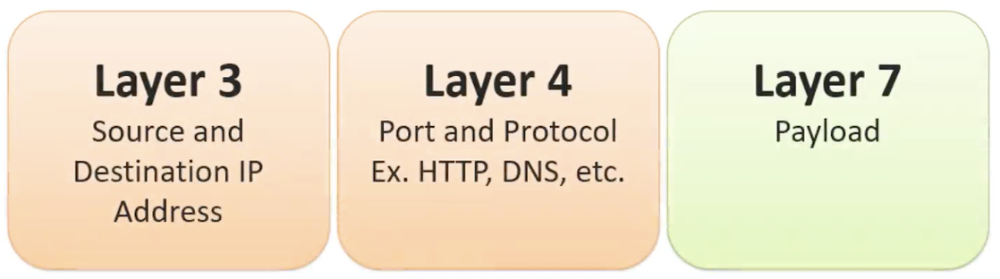

---
categories:
  - network|네트워크
date: 2025-01-23T16:26:29+09:00
draft: false
tags:
  - network
title: "[Network] Firewall"
---
## Firewall
>A device or software for network security that monitors and controls network traffic, allowing only authorized traffic to pass through while blocking unauthorized access or attacks.

### Key Functions
- **Traffic Filtering**
	- Firewalls allow or block network traffic based on the source IP address, destination IP address, port number, protocol, etc.
- **Intrusion Prevention**
	- Detects and blocks intrusions or attacks that can occur through the network.
	- For instance, it prevents hackers from attempting to access the server.
- **Network Segmentation**
	- A firewall is placed between the internal network and the external network (e.g., the internet) to protect the internal network from external threats.
- **Logging and Monitoring**
	- Firewalls record logs of passing traffic, enabling the monitoring of suspicious activities or attack attempts.

Firewalls can be implemented as **hardware** devices or as **software** running on network operating systems.

### Hardware vs. Software
> Below are the differences between hardware and software firewalls:

| **Feature**       | **Hardware Firewall**         | **Software Firewall**         |  
| ------------------ | ----------------------------- | ----------------------------- |  
| **Configuration**  | Separate physical device      | Program running on the OS     |  
| **Installation Location** | Installed at the network boundary | Installed on specific devices or servers |  
| **Performance**    | High-performance, suitable for large-scale networks | May consume system resources, affecting performance |  
| **Management**     | Managed via dedicated console or web interface | Managed directly within the device |  
| **Cost**           | Expensive (includes hardware and software) | Affordable or free |  
| **Flexibility**    | Limited mobility, requires environment-specific setup | Portable, easy to configure and update |  
| **Security Features** | Advanced features (e.g., VPN, IDS/IPS) | Basic traffic filtering, some advanced features |  
| **Suitable Environment** | Large networks, data centers, ISPs | Personal users or small networks, device-specific protection |  

## Layer 3 & 4 Firewall
> Layer 3 and Layer 4 firewalls filter traffic at the **Network Layer (Layer 3)** and **Transport Layer (Layer 4)** of the OSI model. These are often used together.

### Layer 3
- Operates at the **Network Layer (Layer 3)** of the OSI model.
- Filters traffic based on **IP addresses** (source and destination), **subnet masks**, and **routing paths**.
- **Examples**:
	- Blocking or allowing traffic based on IP addresses or network paths.

```bash  
# Allow: All traffic from IP 192.168.1.100  
iptables -A INPUT -s 192.168.1.100 -j ACCEPT  

# Block: All traffic to IP 192.168.1.200  
iptables -A OUTPUT -d 192.168.1.200 -j DROP  

# Allow: All traffic from subnet 192.168.1.0/24  
iptables -A INPUT -s 192.168.1.0/24 -j ACCEPT  

# Block: ICMP (ping) traffic from IP 192.168.1.100  
iptables -A INPUT -s 192.168.1.100 -p icmp -j DROP  
```  

### Layer 4
- Operates at the **Transport Layer (Layer 4)** of the OSI model.
- Filters traffic based on **port numbers** and **protocols** (TCP/UDP).
- Uses TCP or UDP port numbers to manage traffic.
- **Examples**:
	- Allow HTTP traffic and block FTP traffic.

```bash  
# Allow: All TCP traffic on port 80 (HTTP)  
iptables -A INPUT -p tcp --dport 80 -j ACCEPT  

# Block: All UDP traffic on port 53 (DNS)  
iptables -A OUTPUT -p udp --dport 53 -j DROP  

# Allow: TCP traffic on port 22 (SSH)  
iptables -A INPUT -p tcp --dport 22 -j ACCEPT  

# Allow: Traffic on ports 80 (HTTP) and 443 (HTTPS)  
iptables -A INPUT -p tcp -m multiport --sports 80,443 -j ACCEPT  

# Block: All traffic on port 8080  
iptables -A INPUT -p tcp --dport 8080 -j DROP  
```  

### Combined Rule Examples
> Typically, Layer 3 and Layer 4 are used together.

```bash  
# Allow: TCP traffic on port 443 (HTTPS) from IP 192.168.1.100  
iptables -A INPUT -s 192.168.1.100 -p tcp --dport 443 -j ACCEPT  

# Block: All traffic on port 25 (SMTP) from IP 192.168.1.100  
iptables -A OUTPUT -s 192.168.1.100 -p tcp --dport 25 -j DROP  
```  

### Cisco ACL
The examples above use the `iptables` command in **Linux**. `iptables` is Linux-based firewall software used for traffic filtering.

For Cisco devices running Cisco IOS, **ACL (Access Control List)** rules with different syntax are used. Below are some examples:

```bash  
access-list 101 permit tcp any any eq 80  
# Allow TCP traffic on port 80 (HTTP) from any source to any destination  

access-list 102 permit tcp 192.168.1.100 0.0.0.0 10.10.10.0 0.0.0.255 eq 22  
# Allow: TCP traffic on port 22 (SSH) from IP 192.168.1.100 to the subnet 10.10.10.0/24  

access-list 103 deny icmp 192.168.0.0 0.0.255.255 any  
# Block: All ICMP (ping) traffic from the 192.168.0.0/16 network  

access-list 104 deny tcp any any eq 20  
# Block: FTP data port (20) traffic  
access-list 104 deny tcp any any eq 21  
# Block: FTP command port (21) traffic  

access-list 105 permit tcp any any range 1000 2000  
# Allow: TCP traffic on ports 1000–2000 from any source to any destination  
```  

## Level 7 Firewall
> **Operates at the Application Layer (Layer 7)** of the OSI model, often referred to as a **Next-Generation Firewall (NGFW)**. Unlike traditional firewalls filtering traffic at Layers 3 and 4 based on IP addresses and ports, NGFWs analyze and manage traffic based on **applications, users, and data content**.

### Key Features
- **Application Awareness and Control**
	- Recognizes specific applications (e.g., Facebook, YouTube, Skype) and manages traffic.
	- Example: Allow Facebook access but block Facebook chat.
- **Deep Packet Inspection (DPI)**
	- Analyzes not only packet headers but also the payload to detect malicious content or unauthorized data transfer.
- **User-Based Policies**
	- Integrates with authentication systems like Active Directory or LDAP to control traffic for specific users or groups.
	- Example: Block social media for the "Guest" group but allow it for the "Marketing" group.
- **Integrated Intrusion Prevention System (IPS)**
	- Detects and blocks malware, ransomware, and zero-day attacks.
- **SSL/TLS Encrypted Traffic Inspection**
	- Decrypts encrypted traffic to detect hidden malicious activities or data exfiltration.
- **Advanced Threat Protection**
	- Uses sandboxing to analyze suspicious files or code in an isolated environment.
- **Content Filtering and Data Loss Prevention (DLP)**
	- Restricts access based on web content categories (e.g., adult content, gambling, social media).
	- Prevents the leakage of sensitive data like credit card numbers.
- **Cloud Integration**
	- Seamlessly integrates with hybrid cloud security solutions and SD-WAN.

### Differences Between Traditional and Next-Generation Firewalls

| **Feature**            | **Traditional Firewall** | **Next-Generation Firewall (NGFW)** |  
| ----------------------- | ------------------------ | ----------------------------------- |  
| **Operating Layer**     | OSI Layers 3/4          | OSI Layer 7 (Application Layer)    |  
| **Application Awareness** | No                     | Yes                               |  
| **User-Based Policies** | No                     | Yes                               |  
| **Intrusion Prevention** | Requires separate device | Integrated                        |  
| **Encrypted Traffic Inspection** | No             | Yes                               |  
| **Real-Time Threat Intelligence** | No           | Yes                               |  

